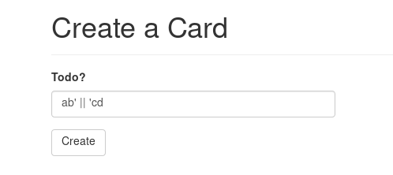
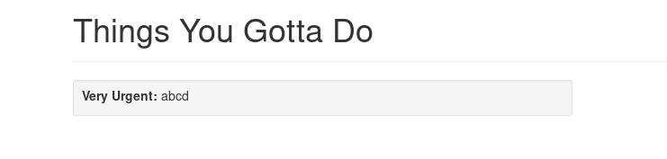
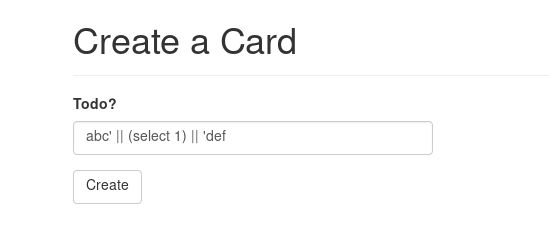
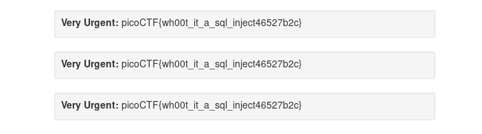

## Empire 1 (400)

#### Description
> Psst, Agent 513, now that you're an employee of Evil Empire Co., try to get their secrets off the company website. https://2019shell1.picoctf.com/problem/12234/ (link) Can you first find the secret code they assigned to you? or http://2019shell1.picoctf.com:12234

#### Hint
> Pay attention to the feedback you get.

> There is *very* limited filtering in place - this to stop you from breaking the challenge for yourself, not for you to bypass.

> The database gets reverted every 2 hours if you do break it, just come back later

#### Solution
After login, we got a place to add a Card.
First in my mind, I thought it is a SSTI chal. But after some fuzzing, I realize that I'm wrong. It's SQL injection chal.
If we inject `ab' || 'cd`, we will receive `abcd`.




The concat string is `||`, so db is `PostgreSQL` or `Oracle`.
To distingush between `PostgreSQL` and `Oracle`, we inject `ab' || (select 1) || 'cd`and got `ab1cd`. So DB is `PostgreSQL`, because `Oracle` need the keyword `from` in `select` statement.



However, there are some filters, so I cannot dump the database. With some lucky, the final payload to get flag is:

```
' || (select secret from user where id=3 ) || '
```


#### Flag
`picoCTF{wh00t_it_a_sql_inject46527b2c} `