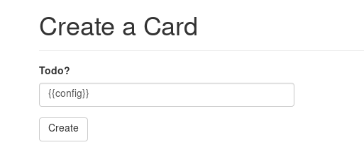
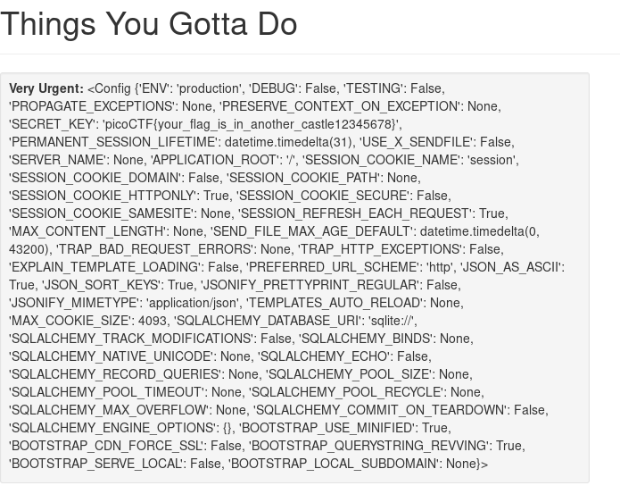
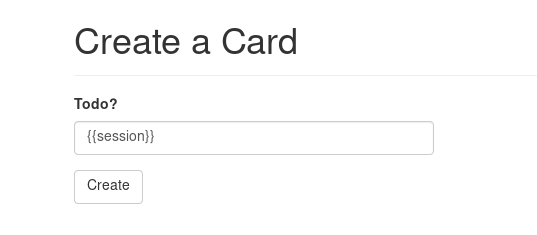
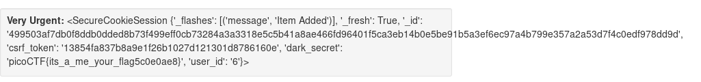

## Empire 2 (450)

#### Description
> Well done, Agent 513! Our sources say Evil Empire Co is passing secrets around when you log in: https://2019shell1.picoctf.com/problem/13253/ (link), can you help us find it? or http://2019shell1.picoctf.com:13253 

#### Hint
> Pay attention to the feedback you get.

> There is *very* limited filtering in place - this to stop you from breaking the challenge for yourself, not for you to bypass.

> The database gets reverted every 2 hours if you do break it, just come back later

#### Solution
This time, It's a real SSTI chal :)
This [resource](https://github.com/swisskyrepo/PayloadsAllTheThings/tree/master/Server%20Side%20Template%20Injection) is awsome.
With some recons, we know that the template is `Jinja2`.

To get flag, inject this:

#### Flag
`picoCTF{its_a_me_your_flag5c0e0ae8}`